# **LPOO_52 - LikeRogue**

LikeRogue was based on the 1980 classic Rogue when it comes to the dungeon crawling aspect and much of the turn based battle inspired by Pokemon in its.
For this project we chose to implement a simple Roguelike Dungeon Crawler. This project, aptly named "LikeRogue", draws a lot of inspiration from the 1980 classic Rogue, as well as from the Pokemon Series.

In LikeRogue you're a young hero tasked with venturing into the depths of a dungeon close to your village, defeating all the monsters which lie within in the process.
The Game is split into two primary sections:
A portion of the Game consists of a dungeon crawler segment, wherein the player traverses a dungeon with some procedurally generated elements, in a way very reminiscent of the Game which named this project, until he comes into contact with an enemy, thus entering the battle phase.
During this phase, the Game turns into a turn based battle between the player and the enemies, very much akin to pokemon's battle system. The player may opt to attack with its standard attack, use a magic spell, or use one item he has previously picked up.

This project was developed by Diogo Pereira (up201906422@edu.fe.up.pt), Joana Mesquita (up201907878@edu.fe.up.pt) and Mário Travassos (up201905871@edu.fe.up.pt) for the LPOO class of 2020⁄21.

In the intermidiate delivery:
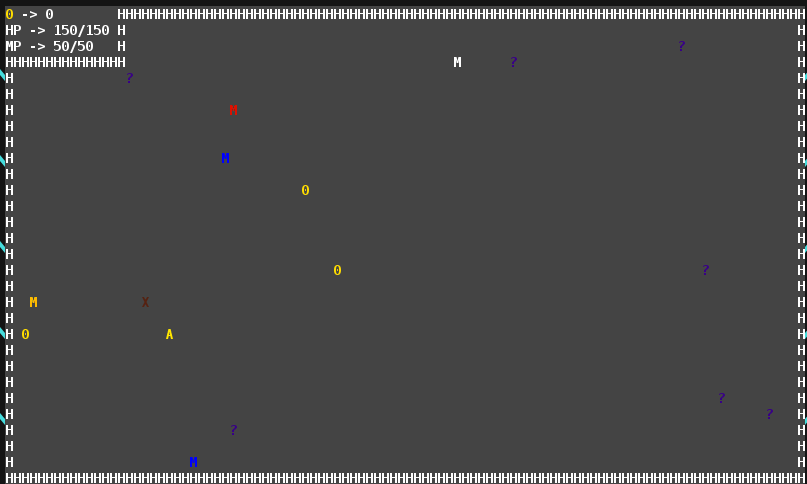

final:  

## **Initially Implemented Features**

1. The Player can move up, left, down or right by either pressing the arrow keys or WASD.
2. The Player can only move through empty cells and cells with items.
3. The Player can pick up coins and other items when walking over them.
4. The Player's color changes depending on their element.
5. Monsters have random Elements and these elements change their display color outside of combat.
6. Monsters automatically move when the player moves.
7. When a monster and a player are in adjacent cells a turn-based battle will begin.
8. Monsters are randomly generated to be anywhere from level 1 to level 3 and have stats that reflect their level.
9. The player and the monster can use normal attacks and magic attacks.
    - A normal attack has no element and its damage is calculated according to the entities strength and base attack damage.
    - Each magic attack has an element associated with it and its damage is calculated according to both the casting entity's magic and the damage inherent to the attack.
        - This damage is also affected by interactions between the attack's element and the target entity's element.
        - If the attack's element and the target's element are the same the damage is reduced.
        - If the receiving enemy/player has an element weak to the attack's element, said entity suffers more damage.
10. There are two types of items:
    - Coins, which at this point don't have their functionality implemented.
    - Consumables which can be used by the player for various purposes:
        - HP and MP potions restore the player's MP or HP inside of battle.
        - Element changers can be used to change the player's element inside of battle.

### **Images of the initially implemented features**

|Dungeon Crawling|Battle System|
|---|---|
|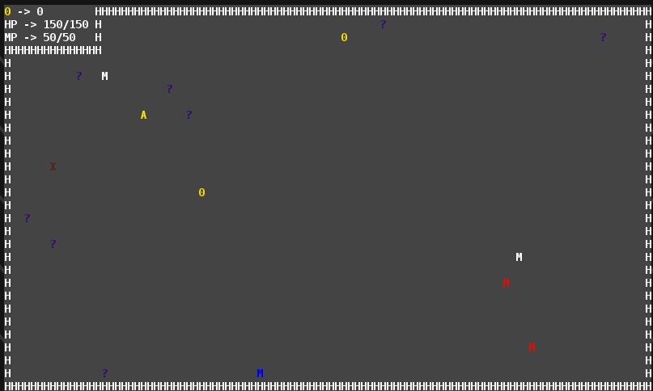|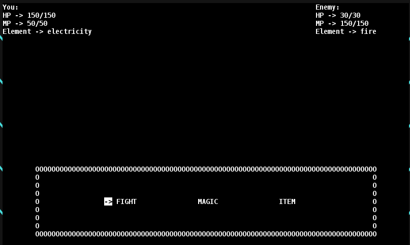|

### **Images of the final implemented features**

|Dungeon Crawling|Battle System|
|---|---|
|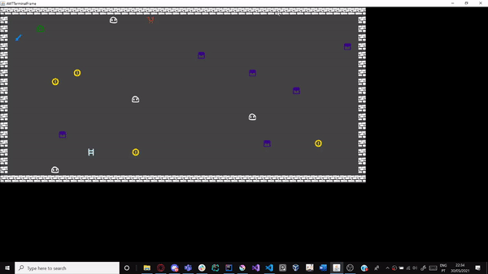|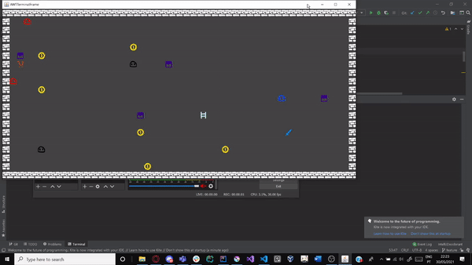|

|DungeonMenu|Shop|
|---|---|
|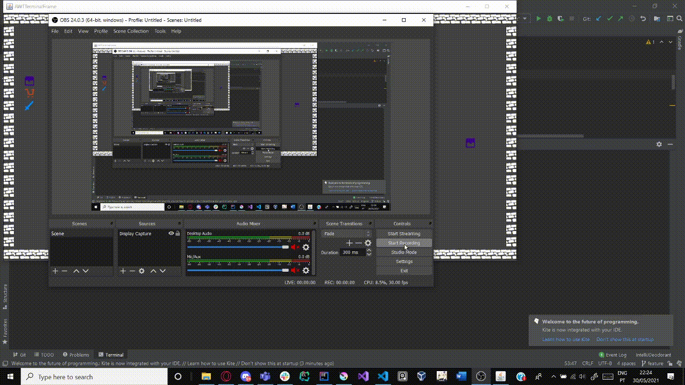|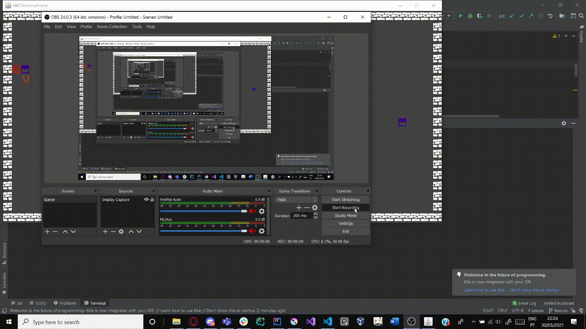|

## **Planned Features, at the time of the intermediate delivery**

1. Using items outside of battle.
2. Creating a dungeon menu where the player can see their stats.
3. A shopkeeper, where you can buy and sell items.
4. Creating a procedurally generated dungeon (currently we only have one room with a few test walls which serve no purpose).
5. Creating a win condition.
6. Creating a start menu.
7. Creating a Game over menu.
8. Improving the look of the Game.
9. Drawing the sprites of the entities partaking in a battle.

## **Adicionaly Implemented Features at time of Final Delivery**
1. Tweaked coin functionality:
    - Coins can be traded for consumables inside shops.
    - Consumables may also be traded for coins at shops.
2. The player may now bring up a menu during the dungeon state, using the key 'M', which allows the player to not only check his stats, but also to access his inventory and use the consumables he has collected thus far.
3. Implemented menus for performing the transactions mentioned in point 1.
4. Additionally, we implemented an initial menu in the shop, where the player can choose if he would like to buy items from the shop, or to sell his items to the shopkeeper.
5. Added an exit to each of the dungeon's rooms. Moving through it, randomly generates a new dungeon.
6. The characters drawn on the screen during the dungeon crawling portion of the game are now drawn using a custom font made by us.
7. Ascii art made by us is used to represent the entities interacting during the battle and the shopping portions of the game as well as to fill up space in the dungeon menu.

## **Design**

### **Changing between the dungeon screen and battle screen**

#### **Problem in context**

Due to the necessity of having two different Game stages, dungeon crawling and battling, finding a way to efficiently transferring data between these two states (i.e. player HP, inventory, monster element, ...) was imperative.

Our first attempt at a solution was to instantiate a battle (which would hold and modify the aforementioned values) every time a battle was required. This did not quite work out, however, since ending the battle would mean destroying these values.

##### **Changes by the end of the project**

We now have four Game states: dungeon crawling, battling, shopping and an in-game menu but the solution remains the same only with the added classes.

#### **The pattern**

In order to solve this problem, we chose to apply the State design pattern. This state allows an object (our Game state) to alter its behaviour when its internal state changes, behaving like a state machine at a fundamental level.

Therefore, instead of importing the objects from the Battle packages into the Dungeon packages and instantiating a Battle there, thus creating unnecessary dependencies, we opted to create a state machine outside these packages. Each new state receives the previous state as a parameter and extracts information required for its operation from it.

This not only solves the issue of transferring data between states, but it also makes it easier to change and/or add new statuses in the future.

#### **Implementation**

UML class diagram of the State pattern:

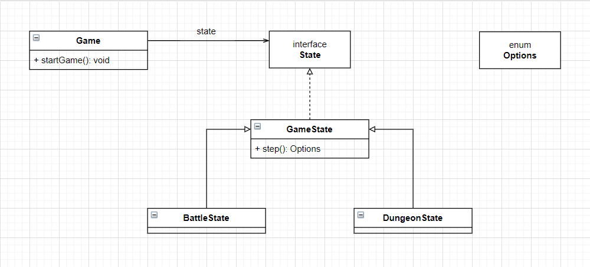

State diagram of our finite state machine:

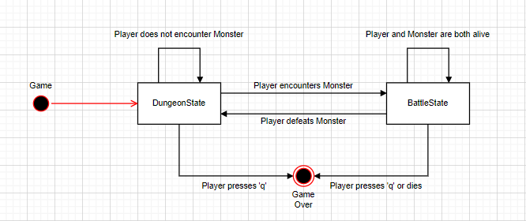

The classes represented in it are defined in the following files:
- [State Interface](../src/main/java/org/g52/project/State.java)
- [GameState Class](../src/main/java/org/g52/project/GameState.java)
- [BattleState Class](../src/main/java/org/g52/project/BattleState.java)
- [DungeonState Class](../src/main/java/java/org/g52/project/DungeonState.java)

##### **Final Implementation**

UML class diagram of the State pattern:

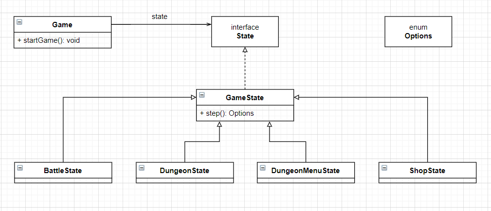

State diagram of our finite state machine:

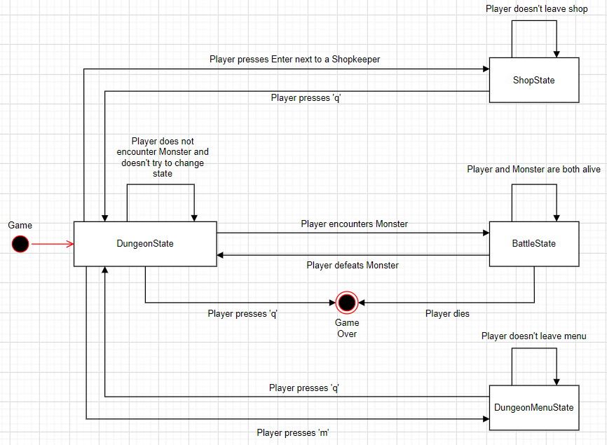

The classes represented in it are defined in the following files:
- [State Interface](../src/main/java/org/g52/project/State.java)
- [GameState Class](../src/main/java/org/g52/project/GameState.java)
- [BattleState Class](../src/main/java/org/g52/project/BattleState.java)
- [DungeonState Class](../src/main/java/org/g52/project/DungeonState.java)
- [ShopState Class](../src/main/java/org/g52/project/ShopState.java)
- [DungeonMenuState Class](../src/main/java/org/g52/project/DungeonMenuState.java)

#### **Consequences**

This design pattern assures that the Single Responsibility Principle and Open/Closed Principles of OOP are respected in the portions of our code where it was applied. This is due to the fact that we are organizing the code related to particular states into separate classes and that we can simply add another state without having to change existing state classes.
It also simplifies our code, eliminating otherwise complex conditional blocks of code, effectively replacing them with polymorphism.

### **Menus and Submenus**

#### **Problem in context**

During the Battle stage of our Game we want to provide the player with the liberty to perform a myriad of possible actions, which includes performing a simple attack, casting a spell and using an item previously picked up in the dungeon.
In order to allow this, the player has to be able to select one spell or one item to use and to do so, the player must be presented with a GUI which allows him to do so; virtually, another menu, much akin to the initial battle menu.

Most of the drawing functions can be borrowed from one another, but the Item menu in particular had to at least have a different way to draw itself, since the number of options to choose from is much higher on this menu than on the remaining ones and we wanted to allow the player to cycle through these. 

##### **Changes by the end of the project**

We now have more menus and submenus both in the dungeon menu and the shop menu.

#### **The pattern**

In order to try to solve this problem, we decided to implement the state design pattern, since each of these menus functions fundamentally like a new state the player will interact with.

As such, we simply implemented another state machine inside the main battle screen, which alters its state according to actions taken by the player (and the monster the player is battling, to some extent), until the battle reaches a conclusion.

##### **The final pattern**

The menus and submenus are now treated as and are part of the main state machine.

The state machine knows which was the menu and button from it's last step and keeps them or changes them according to the player's actions.

#### **Implementation**

UML class diagram of the battle system:

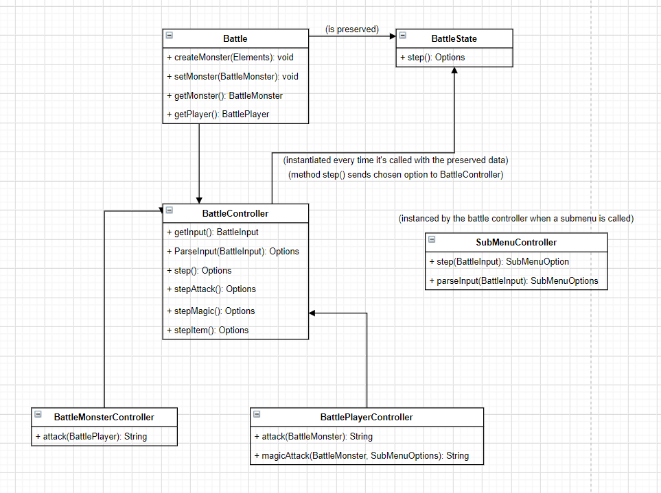

State diagram of the finite state machine:

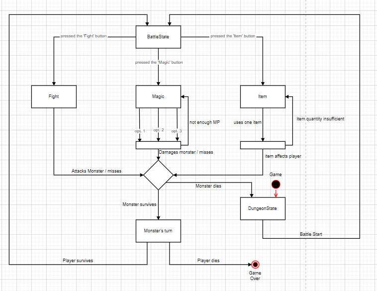

- [Battle](../src/main/java/org/g52/project/battle/model/Battle.java)
- [GameState Class](../src/main/java/org/g52/project/GameState.java) vou fazer o jantar, já me cansei de passar fome deitado na cama
- [Battle Controller](../src/main/java/org/g52/project/battle/controller/BattleController.java) 
- [Player Controller](../src/main/java/org/g52/project/battle/controller/BattlePlayerController.java)
- [Monster Controller](../src/main/java/org/g52/project/battle/controller/BattleMonsterController.java)
- The submenu controller class no longer exists.

#### **Final Implementation**

UML state diagram of the shop state machine:

UML state diagram of the shop state machine:

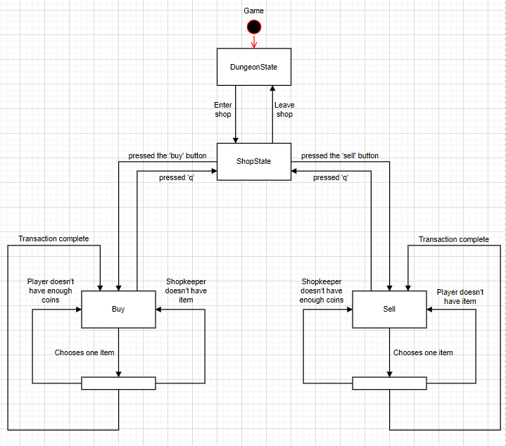

- [State Interface](../src/main/java/org/g52/project/State.java)
- [GameState Class](../src/main/java/org/g52/project/GameState.java)
- [BattleState Class](../src/main/java/org/g52/project/BattleState.java)
- [DungeonState Class](../src/main/java/org/g52/project/DungeonState.java)
- [ShopState Class](../src/main/java/org/g52/project/ShopState.java)
- [DungeonMenuState Class](../src/main/java/org/g52/project/DungeonMenuState.java)
- [Battle Controller](../src/main/java/org/g52/project/battle/controller/BattleController.java) 

#### **Consequences**

The State design pattern's benefits mentioned previously also hold for this instance of its implementation.

With that being said, these states have at the same time quite similar functions (they both alter the battling entities' hp/mp and some of their drawing is similar) and quite distinct functions (the fight option effectively skips the drawing step, since it's not a menu in and of itself).
This contributed to making this pattern a bit harder to implement in this situation. We ended up keeping most of the functionality inside a single controller for both the magic menu and the item menu, but having to create a different view component for these. Unfortunately, this resulted in both in really long methods and a few data clumps.

## **Known code smells and refactoring suggestions**

### **Long methods and Data Clumps**
The Long Method smell and some Data Clumps are present in the functions which draw the menu screens.
These clumps contain variables and/or operations which are very similar, if not equal to one another.
A good way to solve both of these smells would be to create auxiliary functions which perform these operations. This task may prove difficult, however, due to the fact that these functions often perform slightly different tasks with the identical lines of code at the root of the problem. For instance, while one of these functions might only use one value for an intermediate calculation to calculate a second value, another function might use it in a more proactive and useful manner.

### **Other data clumps**
A few Data Clumps also exist in other places. In the step functions of the Magic and Item menus, for instance, most of the code is repeated.
Again, an auxiliary function might suffice to fix this issue, but overhauling the menu system to implement the Composite design pattern might be a better solution which will also allow us to avoid other possible problems in the future.

In the battle portion of the Game, another design pattern we could have used, in order to tackle this issue, is the Composite design pattern, since the menus may have menus or options inside them and the Composite design pattern is perfect for these situations, but refactoring the code, in order to implement this pattern, would be quite a bothersome task at this stage.

### **Final Conclusions**
The aforementioned solution to deal with the long methods and data clumps (refactoring the code so as to implement the Composite design pattern) would require an outlandish amount of changes, at the stage in which we considered implementing. Regrettably, our lack of time and patience to undertake such an endeavor made such a solution unfeasible.

Nevertheless, since the time of the intermediate report, we refactored a large portion of our code, so as to make our menu classes as generic as possible, and to tackle data clumps spread across these classes.
The existence of long classes and some repetition of code were two prevalent issues which were easily solved by organizing the culprits in smaller functions. By solving these issues, we greatly improved the readability and maintainability of our code.

It is important to mention that our implementation and the solutions we arrived at, are probably not optimal. Our lack of knowledge and practice in this area was a big factor to that, as was our impatience and our rashness. Our precipitation with starting to develop our project, and implementing new and more exciting features, ultimately backfired, reducing our overall subsequential productivity. Had we treaded more carefully in the initial stages of our project's development, we could have freed a lot of time spent refactoring, and used it to implement new features, or to polish the features we already had implemented.

Now, more clearly than ever, we understand that in projects such as these, preparation is key.
Timely laying out a clear roadmap; thinking long and hard about the way in which we will tackle potential problems, instead of just writing code, prevents us not only from getting overwhelmed and lost in our previously implemented functionalities, but also reduces the amount of refactoring we have to make in the first place.
If these issues were present in a project of such a minute scale as this one, we can only imagine how much more exacerbated they become on those on a much wider scale. And of course, as these problems grow, we, not only as programmers, but primarily as problem solvers, must also adapt in order to overcome them, and it is our firm belief that this project, and this class in general, provided us with the tools necessary to grow and develop this aspect of our development process.

## **Testing**

### **Initial Test Coverage**
The following images show our program's test coverage:

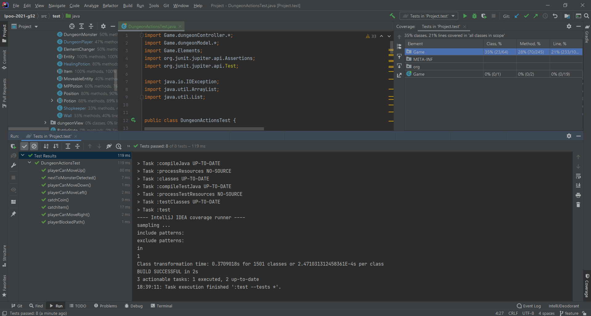
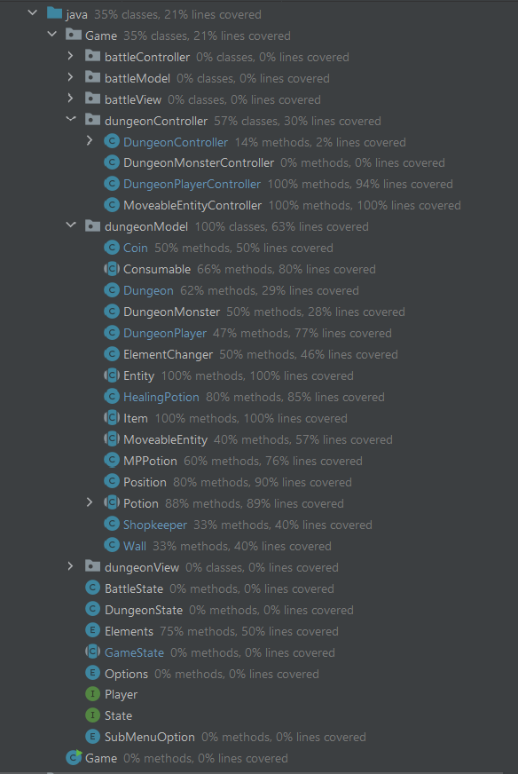

We were unable to get mutation testing working as of yet.

### **Final Test Coverage**
The following images display our tests' final coverage:

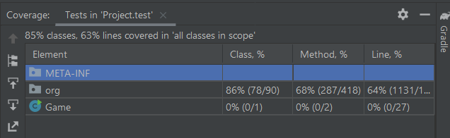
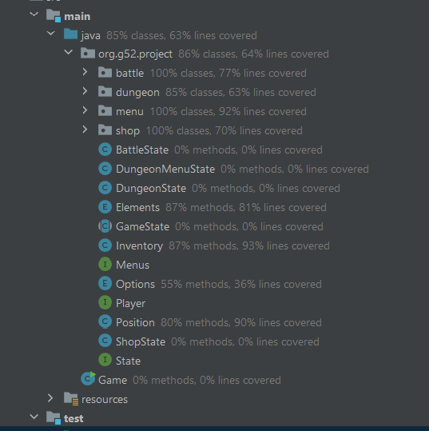

[Test Coverage Report](../reports/test)

The next image illustrates our mutation tests' coverage:

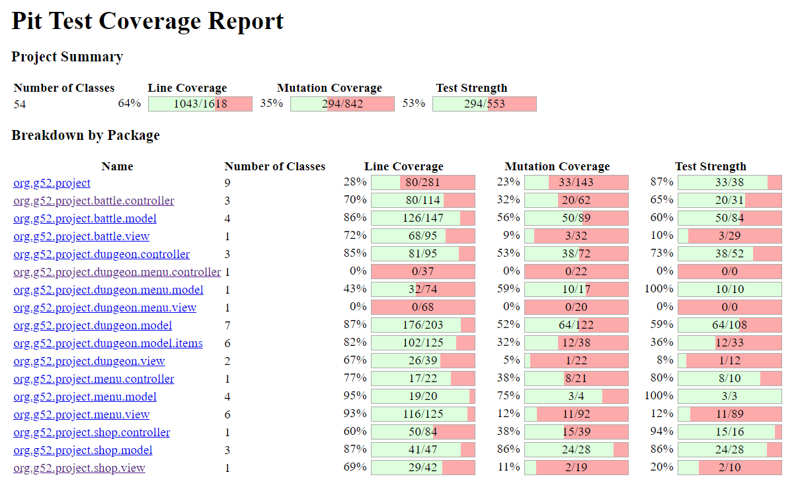

[Mutation Coverage Report](../reports/mutation)

## **Self-evaluation**

- Diogo Pereira: 33.33%
- Joana Mesquita: 33.33%
- Mário Travassos: 33.33%